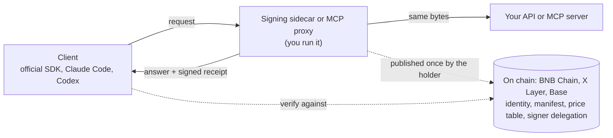

# TapeAPI

**A signed receipt for every AI call.** Put a sidecar in front of your OpenAI- or Anthropic-compatible API, and every
answer comes with a receipt anyone can check: who answered, to which request, with which bytes, and what usage and price
were claimed. Your users keep their official SDKs and change only the base URL.

TapeAPI is the signed API layer of [TapeOut](https://tapeout.net). The same on-chain identity and signatures also cover
MCP tools and end-to-end encrypted channels and groups, on BNB Chain, X Layer and Base.

[](https://github.com/BruceLanLan/tapeapi/actions/workflows/ci.yml)
[](LICENSE)
[](LICENSE-SPEC)
[](https://tapeapi.fun/docs/)
[](https://tapeapi.fun/playground/)
[](https://tapeapi.fun/status/)

[中文说明](README.zh-CN.md) · [Website](https://tapeapi.fun) · [Docs](https://tapeapi.fun/docs/) · [Guides](docs/guides/) · [Specifications](spec/) · [Examples](examples/) · [Changelog](CHANGELOG.md) · [Roadmap](docs/ROADMAP.md)

> **1.7: container agents (experimental, phase 0).** Container + agent = container agent. The holder of a container
> signs a mandate saying which agent may do which task for it; the agent takes the task and delivers; the principal
> accepts; payment is a plain transfer that anyone can verify on their own. No new contract. **The limits, plainly:**
> phase 0 has no on-chain enforcement, and a mandate limits no spending (one that names an amount is refused); the
> `@tapeapi/sdk/agent` subpath is experimental and outside the 1.x compatibility promise; this project has not had a
> third-party audit. [New in 1.7](#new-in-17) · [Container agents guide](docs/guides/container-agents.md)

> **Status: released, 1.7.0.** Everything live today is free. From 1.0 on, TapeAPI follows semantic versioning:
> breaking changes come only in 2.0. Paid channels (TAPI-22) are experimental and not deployed. Nothing here has had a
> third-party audit. **Security note:** on 1.0.0 to 1.4.0, streamed AI receipt verification could, under particular
> chunking, report a truncated or content-injected stream as verified; it was fixed in 1.5.0, so please upgrade
> ([release notes](https://github.com/BruceLanLan/tapeapi/releases/tag/v1.5.0)).

## What it does

- **Signed answers and receipts** (Stable since 1.0). Every answer is signed by a key the circuit's holder delegated on
  chain and bound to its request; an AI call also gets a usage receipt, priced from the table on chain.
  [Call a service](docs/guides/consume.md) · [For AI providers](docs/guides/ai-providers.md)
- **MCP tools** (Stable since 1.0). Signed results with a receipt, and tool definitions pinned on chain by their hash:
  a public endpoint, a signing proxy for your own server, and `tapeapi-mcp` to check every answer locally.
  [MCP](docs/guides/mcp.md)
- **Private channels and groups** (Stable since 1.0). End-to-end encrypted, between containers, over a relay or
  ChannelBus. [Channels](docs/guides/channels.md) · [Groups](docs/guides/groups.md)
- **Conformance with TapeOut's official TAP-10** (1.4 to 1.5, experimental). An optional mode, `conform: 'tap10'`,
  follows TAP-10 for resolution, all-chain resolution, the messaging path and strict reads; the default does not change
  before 2.0. [The TAP-10 conformance mode](docs/guides/upgrade-1.0.md#the-tap-10-conformance-mode-14-experimental)
- **Streamed AI receipts, with usage you can check** (1.5 to 1.6). 1.5 makes a streamed receipt fail when the stream
  was cut short or had content added; 1.6 adds the opt-in `requestUsage`, which puts the usage of a streamed OpenAI Chat
  answer inside the signed stream so it is checked like a whole answer's (it does not prove the upstream's own count).
  [Streamed usage: three ways](docs/guides/ai-providers.md#the-usage-of-a-streamed-chat-answer-three-ways)
- **Container agents** (1.7, experimental). A holder-signed mandate, a task thread from offer to acceptance, and a
  read-only payment check, with no new contract and no enforcement in phase 0.
  [Container agents](docs/guides/container-agents.md)

## New in 1.7

Container + agent = container agent, phase 0. All of it is experimental and outside the 1.x compatibility promise; the
formats follow the public discussions TapeOutProtocol/TAPs#40 (mandate) and #41 (task protocol) and may change with them.

- **`@tapeapi/sdk/agent`.** Four holder-signed EIP-712 messages: `Mandate`, `TaskOffer`, `TaskVerdict` and
  `MandateRevocation`. `createAgentKit` checks a mandate, a task thread (offer, accept, mandate, delivery, acceptance,
  revocation) and its evidence, and flags a self-hire (`selfHire`). `createPaymentKit` makes payment orders, builds only
  a plain `transfer` (never an `approve`), reads the recipient from the chain only, and checks a payment read-only in the
  15 steps of TAP-10 §19. `forWallet(td, { chainId, hub })` is what every typed-data result must pass through before it
  reaches a wallet: it strips the console's notes and refuses a payload whose chain or hub is not the expected one.
- **`tapeapi-verify task <thread.json> [--payment <recipient> <index>] [--rpc <url>...]`** checks a task thread, and
  with `--payment` its payment, from the command line.
- **[`examples/agent-service`](examples/agent-service/)**: an agent runtime and a hiring script that runs the whole flow
  offline. Test vectors in `spec/vectors/container-agent.json` take the set from 480 to 514 checks; the independent
  Python implementation agrees with the SDK.
- **Maintenance contribution capped at 20%** (was 50%) in the escrow contract; the default stays 1% and a provider can
  set 0. The escrow is still not deployed and not audited, so no live channel is affected.
- **Custody assets.** [TAPI-22](spec/TAPI-22.md) gains an informative section on the tokens the escrow would hold: a
  USDT-pegged token first, BEM and WBNB on demand; native BNB is not held (it is wrapped as WBNB).

Run it in three minutes, at the root of a checkout with its dependencies installed (the `git clone` and `npm ci` lines
under [Try it](#try-it)):

```bash
node examples/agent-service/hire.mjs
```

It prints what a wallet would be asked to sign at each step, the thread check (`enforcement none`) and the verdict, all
on the SDK's fake chain with test keys: no network, no real wallet, no cost. `--same-holder` shows a self-hire being
flagged; `--pay` adds the payment as unsigned transactions.

## Start here

| You are | Your first five minutes | Guide |
|---|---|---|
| **An AI provider or relay** (new-api, a gateway, your own models) | `docker compose up` in [`examples/new-api-sidecar`](examples/new-api-sidecar/), publish your price table in the [holder console](https://tapeapi.fun/console/), point your users' base URL at the sidecar | [For AI providers](docs/guides/ai-providers.md) |
| **An MCP server author** | Run the [signing proxy](examples/mcp-proxy/) in front of your server, then publish the manifest with the console | [Tape out your MCP server](docs/guides/mcp.md#tape-out-your-own-mcp-server) |
| **An app developer** | Run the examples below; check AI receipts with `createVerifyingFetch`; start channels and groups from [`examples/group-chat`](examples/group-chat/) | [Call a service](docs/guides/consume.md) · [Channels](docs/guides/channels.md) · [Groups](docs/guides/groups.md) |
| **A TapeOut circuit holder** | Open your circuit's container, then generate a service key, sign the delegation and publish the manifest in the console | [Run a service](docs/guides/provide.md) |
| **A Claude, Cursor or other MCP user** | Add `https://api.tapeapi.fun/mcp` as a connector | [MCP](docs/guides/mcp.md) |
| **Hiring an agent for a container, or building one** (experimental) | Run `node examples/agent-service/hire.mjs` from a checkout and read what each step asks a wallet to sign | [Container agents](docs/guides/container-agents.md) |

## Try it

**A signed answer.** The public service `11.1013.tape` answers eight free, block-pinned reads of BNB Chain:

```bash
curl -s https://api.tapeapi.fun/tapeapi/v1/bnbUsd -H 'content-type: application/json' -d '{"id":"1","params":{}}'
```

curl shows the signed envelope but checks nothing. The SDK checks it. It is not on npm yet; install it from the GitHub
release (Node.js 20 or later):

```bash
npm install https://github.com/BruceLanLan/tapeapi/releases/download/v1.7.0/tapeapi-sdk-1.7.0.tgz
```

The server package (`@tapeapi/server`: providers, the AI sidecar, the MCP proxy) depends on this SDK, which is not on
npm either, so installed alone it fails with a 404: install both in one command,
`npm install https://github.com/BruceLanLan/tapeapi/releases/download/v1.7.0/tapeapi-sdk-1.7.0.tgz https://github.com/BruceLanLan/tapeapi/releases/download/v1.7.0/tapeapi-server-1.7.0.tgz`.

```js
// try.mjs: node try.mjs
import { createTapeAPI, rpcUrlsFor } from '@tapeapi/sdk'

const api = createTapeAPI({ rpcUrls: rpcUrlsFor(56) })   // nodes of 3 distinct operators; 2 must agree
const service = await api.resolve('11.1013.tape')         // name, container, on-chain manifest, delegation
const { result, verified } = await api.call(service, 'bnbUsd', {})
console.log(result.bnbUsd, verified)                      // true only after the signature checked out
```

**AI receipts.** Plug `createVerifyingFetch` into the official OpenAI SDK (`npm install openai`; the Anthropic SDK
takes a `fetch` too). Replace `42.1013.tape` with the provider's TapeOut name:

```js
import OpenAI from 'openai'
import { createTapeAPI, rpcUrlsFor, ai } from '@tapeapi/sdk'

const api = createTapeAPI({ rpcUrls: rpcUrlsFor(56) })
const service = await api.resolve('42.1013.tape')        // the AI provider's name (an example)
const { baseUrl } = service.manifest.ai.endpoints.find((e) => e.format === 'openai-chat')
const client = new OpenAI({
  baseURL: baseUrl,                                      // the address the provider published on chain
  apiKey: process.env.API_KEY,                           // your key with that provider, as before
  fetch: ai.createVerifyingFetch({ api, service }),      // checks every receipt; a bad one throws
})
const r = await client.chat.completions.create({ model: 'gpt-4o-mini', messages: [{ role: 'user', content: 'Hello' }] })
console.log(r.choices[0].message.content)
```

No outside provider has published a price table on chain yet, so this was run against the reference sidecar in
[`examples/ai-proxy`](examples/ai-proxy/) (local dev mode); with a real provider only the name changes.

**Claude Code and Codex** cannot read receipts themselves. Run the local verifying proxy and point them at it:

```bash
# Terminal 1 (it keeps running). 42.1013.tape is an example name: put your AI provider's TapeOut name here
npx -y --package=https://github.com/BruceLanLan/tapeapi/releases/download/v1.7.0/tapeapi-sdk-1.7.0.tgz tapeapi-verify 42.1013.tape
```

```bash
# Terminal 2, macOS or Linux
ANTHROPIC_BASE_URL=http://127.0.0.1:8790 claude
OPENAI_BASE_URL=http://127.0.0.1:8790/v1 codex             # Codex (or base_url in config.toml)
```

```powershell
# Terminal 2, Windows PowerShell
$env:ANTHROPIC_BASE_URL="http://127.0.0.1:8790"; claude
$env:OPENAI_BASE_URL="http://127.0.0.1:8790/v1"; codex
```

Run as written, `tapeapi-verify 42.1013.tape` stops with "no file at /.well-known/tapeapi.json": the name is an example
and no service is published under it. To watch a receipt verify end to end without any provider, run the local trial
(no key, no circuit, no cost) from a checkout of this repository, after installing its dependencies once at its root:

```bash
git clone https://github.com/BruceLanLan/tapeapi.git && cd tapeapi
npm ci --no-audit --no-fund
node examples/relay-trial/trial.mjs
```

Running an AI service yourself? Start at [From zero to live](docs/guides/ai-providers.md#from-zero-to-live); the
provider's check, `tapeapi-doctor` (experimental), ships in the same release package.

**MCP.** The same eight reads are tools at `https://api.tapeapi.fun/mcp`, with a signed receipt on every result:

```bash
claude mcp add --transport http tapeapi https://api.tapeapi.fun/mcp
```

No install at all: the [playground](https://tapeapi.fun/playground/) runs the SDK in your browser.

## How it fits together



| Layer | What it is | Spec |
|---|---|---|
| **Identity** | A TapeOut circuit's ERC-6551 container. Whoever holds the circuit owns the service; transfer the circuit and the service moves with it. | [TAPI-20](spec/TAPI-20.md) |
| **Manifest** | `.well-known/tapeapi.json` in the container's on-chain site: endpoints, methods, the AI price table, the hash of MCP tool definitions, the signing key and the holder's delegation of it. | [TAPI-20](spec/TAPI-20.md) |
| **Signed answers and receipts** | Every answer is signed and bound to its request; AI calls get a usage receipt. | [TAPI-21](spec/TAPI-21.md) |
| **Channels and groups** | End-to-end encrypted, over a relay or ChannelBus; the carrier sees ciphertext only. | [TAPI-26](spec/TAPI-26.md), [TAPI-27](spec/TAPI-27.md) |

## What a receipt proves, and what it does not

A receipt proves **who answered** (a key the circuit's holder delegated on chain), **to exactly which request bytes**,
**with exactly which response bytes**, and **what usage and price were claimed**, priced from the table on chain.

It does **not prove which model actually ran**: a provider could label a cheaper model's answer as a dearer one. What
the signature adds is accountability. A receipt cannot be disowned, so anyone running the
[spot-check probe](examples/spot-check/) and publishing the results leaves evidence.

## Status and commitments

- **Live, free, no sign-up:** the public service `api.tapeapi.fun` (8 methods), its MCP endpoint, the public relay
  `relay.tapeapi.fun` (`relaySend`, `relayHandshake`, `relayRecv`),
  [ChannelBus](https://bscscan.com/address/0x486110c35d9b90a9d6D85c8063A065f9e7b6b707), and the website's
  [console](https://tapeapi.fun/console/), [receipt checker](https://tapeapi.fun/verify/),
  [playground](https://tapeapi.fun/playground/) and [status page](https://tapeapi.fun/status/).
- **Available, you run it:** the AI signing sidecar and the new-api package, the MCP signing proxy, `tapeapi-verify`,
  `tapeapi-mcp`, the spot-check probe, and one-call group delivery (`deliverGroupUpdate`) in the SDK.
- **Experimental, not deployed:** paid channels and the escrow ([TAPI-22](spec/TAPI-22.md)), the service directory, and
  circuit-verified methods ([TAPI-25](spec/TAPI-25.md)). None of them is part of the 1.0 stability promise.
- **Experimental, in the SDK:** container agents (`@tapeapi/sdk/agent`, phase 0, since 1.7), outside the 1.x
  compatibility promise. Nothing is enforced on chain: a mandate is a signed statement and limits no spending.
- **What 1.0 promises:** code written against the 1.0 docs keeps working in every 1.x release; everything is Stable
  except what is marked `@experimental` or `@internal`. Coming from 0.x: [Upgrading to 1.0](docs/guides/upgrade-1.0.md).
- **What we do not do:** host the sidecar for anyone (it sees your users' API keys, so you run it); issue a token;
  help anyone get around an upstream provider's bans or regional limits (TapeAPI is for providers working within their
  upstream's terms).
- **Chains:** BNB Chain (chainId 56) for everything, and the only chain where payments will run. X Layer (196) and Base
  (8453) are read-only: identity, resolution, receipts and MCP checks. X Layer has only two independent RPC operators.
- **No third-party audit.** Tests: the JavaScript suite (`npm test`), the contract tests (`forge test`) and an
  independent Python implementation of every signature, hash and encoding (`python3 spec/vectors/verify.py`), all
  three run by CI on every push.

## Privacy, plainly

- **Protected:** channel and group content (end-to-end encrypted); AI receipts carry hashes only, and requests sent
  through the SDK or `tapeapi-verify` get 128 random bits of whitespace, so a short prompt cannot be confirmed from its
  hash; MCP verification links carry hashes only by default; the SDK's `busPrivacyReader` (experimental) reads all of ChannelBus and
  filters locally, so nodes cannot see your rooms.
- **Not hidden:** a service sees what it processes (your request, your IP, your API key); public RPC nodes see your IP
  and which service you check; relays and the chain see channel rooms, timing and sizes; everything on chain is public,
  including future payments.

## Fees

No mandatory protocol fee; a default 1% maintenance contribution that any provider can turn off; the operator has no fee
switch. The contribution applies only when a paid channel settles, out of the provider's share, and the user's price does
not change. A provider can also set more, up to the contract's cap of 20% (lowered from 50% in 1.7). The paid-call escrow is not deployed, so **no call is charged today**. AI providers bill their users off
chain as they do now; the prices in their manifest are published, not settled. See [docs/FEES.md](docs/FEES.md).

## Specifications

These are TapeAPI's own specifications, not TAPs. TapeOut publishes its standards as TAPs, numbered by its editors in
[TapeOutProtocol/TAPs](https://github.com/TapeOutProtocol/TAPs) under TAP-01. After that process appeared we renamed our documents
TAPI-1 and TAPI-20 to TAPI-27 (so that TAP numbers stay with the editors: TAP-20, for example, now belongs to another proposal), and
between 2026-09-30 and 2026-10-01 we submitted eight TAP drafts for parts of them. Editors review the format, not the merits
(TAP-01 §4), so a merge into Draft is not adoption. TAPI-20 to TAPI-27 remain the basis of the 1.x compatibility promise.

| Our spec | Draft (pull request) | The editors' response, as of 2026-10-05 |
|---|---|---|
| TAPI-20 (core: §3.1 to §3.4, §3.6, §3.10) | Service identity and manifest, [#8](https://github.com/TapeOutProtocol/TAPs/pull/8) | Merged on 2026-10-01 as [TAP-11](https://github.com/TapeOutProtocol/TAPs/blob/main/TAPs/TAP-11.md), Draft |
| TAPI-21 | Signed responses, [#10](https://github.com/TapeOutProtocol/TAPs/pull/10) | Merged on 2026-10-04 as [TAP-13](https://github.com/TapeOutProtocol/TAPs/blob/main/TAPs/TAP-13.md), Draft. We made the two requested changes and applied their notes: `voucher` and the payment codes are reserved names, `METHOD_NOT_FOUND` is widened |
| TAPI-20 §3.8, TAPI-21 | MCP tool binding, [#16](https://github.com/TapeOutProtocol/TAPs/pull/16) | Passed the format check; the drafts it requires are now merged (TAP-11, TAP-13). References updated to TAP-11 and TAP-13 |
| TAPI-23 | Attested reads from independent services, [#18](https://github.com/TapeOutProtocol/TAPs/pull/18) | Passed the format check; the drafts it requires are now merged (TAP-11, TAP-13). References updated to TAP-11 and TAP-13. Their notes applied: services sharing a signer count as one party, and attested reads alone must not release funds (a SHOULD NOT in §7) |
| TAPI-26 | Private channels, [#12](https://github.com/TapeOutProtocol/TAPs/pull/12) | References to TAP-13 updated; no response yet |
| TAPI-27 (format 1 only) | Private groups, [#20](https://github.com/TapeOutProtocol/TAPs/pull/20) | No response yet |
| TAPI-20 §3.9, TAPI-21 §3.5 | AI usage receipts, [#26](https://github.com/TapeOutProtocol/TAPs/pull/26) | References to TAP-13 updated; no response yet |
| TAPI-20 §3.2 (proof mode, informative) | Proof-verified reads, [#28](https://github.com/TapeOutProtocol/TAPs/pull/28) | No response yet |
| Follow-ups to TAP-11 | A Security Considerations note on `verifyingContract`, [#35](https://github.com/TapeOutProtocol/TAPs/pull/35); an informative Chinese translation, [#36](https://github.com/TapeOutProtocol/TAPs/pull/36) | No response yet |
| Follow-up to TAP-13 | Wording on reserved names, [#46](https://github.com/TapeOutProtocol/TAPs/pull/46) | No response yet |

TAPI-22, TAPI-24 and TAPI-25 have not been submitted. The container-agent formats of 1.7 are neither a TAPI spec nor a TAP draft yet: they follow the public discussions TapeOutProtocol/TAPs#40 and #41, and a draft is planned. When the editors assign numbers to the other drafts, we rename our references to them. The drafts are written against the official TAP-10 and list, under Backwards Compatibility, where TapeAPI's own 1.x behaviour differs. The SDK follows TAP-10 in an optional conformance mode (`conform: 'tap10'`, experimental: the resolution path since 1.4; all-chain resolution, the messaging path and strict reads since 1.5). Its default behaviour does not change before 2.0.

| Spec | Title | Status |
|---|---|---|
| [TAPI-1](spec/TAPI-1.md) | TapeAPI's document process and statuses | Draft |
| [TAPI-20](spec/TAPI-20.md) | Service identity and manifest, with the AI price table and multi-chain names | Stable (v1); §3.5 Experimental |
| [TAPI-21](spec/TAPI-21.md) | Signed response envelope, with AI usage receipts | Stable (v1) |
| [TAPI-22](spec/TAPI-22.md) | Metered payment: vouchers and escrow | Experimental |
| [TAPI-23](spec/TAPI-23.md) | Attested read, cross-checked by independent providers | Stable (v1) |
| [TAPI-24](spec/TAPI-24.md) | Intent RFQ | Withdrawn |
| [TAPI-25](spec/TAPI-25.md) | Circuit-verified methods | Experimental |
| [TAPI-26](spec/TAPI-26.md) | Private channels between containers | Stable (v1) |
| [TAPI-27](spec/TAPI-27.md) | Private groups of up to 32 containers (up to 128 in the experimental format 2) | Stable (v1) |

The specs are bilingual; English is authoritative. **TAPI-1 and TAPI-20 to TAPI-27 are TapeAPI's own document names,
not TAP numbers**: TAPs are numbered by the editors of
[TapeOutProtocol/TAPs](https://github.com/TapeOutProtocol/TAPs) under TAP-01. Frozen constants that contain an old name, such as the
`TAP-26/…` and `TAP-27/…` labels, never change.

## Repository

[`sdk/`](sdk/) `@tapeapi/sdk` (resolve, call, verify, AI receipts, channels, groups, MCP, container agents) ·
[`server/`](server/) `@tapeapi/server` (providers, the AI sidecar, the MCP proxy) ·
[`contracts/`](contracts/) (ChannelBus, and the experimental escrow and directory) ·
[`spec/`](spec/) (the specs, test vectors, the Python verifier) · [`examples/`](examples/) ·
[`conformance/`](conformance/) · [`site/`](site/) (the website) · [`docs/`](docs/README.md).
Contract addresses are in the [introduction](docs/guides/introduction.md#on-chain-addresses).

Report security issues privately as described in [SECURITY.md](SECURITY.md). Issues and pull requests are welcome; see
[CONTRIBUTING.md](CONTRIBUTING.md) and the [Code of Conduct](CODE_OF_CONDUCT.md).

## License

Code is MIT ([LICENSE](LICENSE)): `contracts/`, `sdk/`, `server/`, `examples/`, `conformance/`, `scripts/`, `site/`.
The specifications in `spec/` are CC0-1.0 ([LICENSE-SPEC](LICENSE-SPEC)).

## Credits

The idea of a service layer for TapeOut, "DeWEB is websites, TapeSend is messaging, TapeAPI is services", came from
**[@Theairresearch](https://x.com/Theairresearch/status/2101640697426448632)**. From 2026-10-05, 10% of TapeAPI's revenue each quarter,
after the direct cash costs paid to third parties, goes to them permanently (definition in BUSINESS.md).

Built on [TapeOut](https://tapeout.net) and [TapeKit](https://github.com/TapeOutProtocol/TapeKit).
