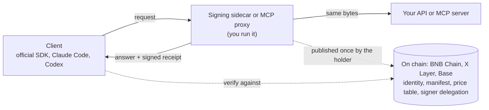

# TapeAPI

**A signed receipt for every AI call.** Put a sidecar in front of your OpenAI- or Anthropic-compatible API, and every
answer comes with a receipt anyone can check: who answered, to which request, with which bytes, and what usage and price
were claimed. Your users keep their official SDKs and change only the base URL.

TapeAPI is the signed API layer of [TapeOut](https://tapeout.net). The same on-chain identity and signatures also cover
MCP tools and end-to-end encrypted channels and groups, on BNB Chain, X Layer and Base.

[](https://github.com/BruceLanLan/tapeapi/actions/workflows/ci.yml)
[](LICENSE)
[](LICENSE-SPEC)
[](https://tapeapi.fun/docs/)
[](https://tapeapi.fun/playground/)
[](https://tapeapi.fun/status/)

[中文说明](README.zh-CN.md) · [Website](https://tapeapi.fun) · [Docs](https://tapeapi.fun/docs/) · [Guides](docs/guides/) · [Specifications](spec/) · [Examples](examples/) · [Changelog](CHANGELOG.md) · [Roadmap](docs/ROADMAP.md)

> **Status: released, 1.2.0.** Everything live today is free. From 1.0 on, TapeAPI follows semantic versioning:
> breaking changes come only in 2.0. Paid channels (TAP-22) are experimental and not deployed. Nothing here has had a
> third-party audit.

## Start here

| You are | Your first five minutes | Guide |
|---|---|---|
| **An AI provider or relay** (new-api, a gateway, your own models) | `docker compose up` in [`examples/new-api-sidecar`](examples/new-api-sidecar/), publish your price table in the [holder console](https://tapeapi.fun/console/), point your users' base URL at the sidecar | [For AI providers](docs/guides/ai-providers.md) |
| **An MCP server author** | Run the [signing proxy](examples/mcp-proxy/) in front of your server, then publish the manifest with the console | [Tape out your MCP server](docs/guides/mcp.md#tape-out-your-own-mcp-server) |
| **An app developer** | Run the examples below; check AI receipts with `createVerifyingFetch`; start channels and groups from [`examples/group-chat`](examples/group-chat/) | [Call a service](docs/guides/consume.md) · [Channels](docs/guides/channels.md) · [Groups](docs/guides/groups.md) |
| **A TapeOut circuit holder** | Open your circuit's container, then generate a service key, sign the delegation and publish the manifest in the console | [Run a service](docs/guides/provide.md) |
| **A Claude, Cursor or other MCP user** | Add `https://api.tapeapi.fun/mcp` as a connector | [MCP](docs/guides/mcp.md) |

## Try it

**A signed answer.** The public service `11.1013.tape` answers eight free, block-pinned reads of BNB Chain:

```bash
curl -s https://api.tapeapi.fun/tapeapi/v1/bnbUsd -H 'content-type: application/json' -d '{"id":"1","params":{}}'
```

curl shows the signed envelope but checks nothing. The SDK checks it. It is not on npm yet; install it from the GitHub
release (Node.js 20 or later):

```bash
npm install https://github.com/BruceLanLan/tapeapi/releases/download/v1.2.0/tapeapi-sdk-1.2.0.tgz
```

```js
// try.mjs: node try.mjs
import { createTapeAPI, rpcUrlsFor } from '@tapeapi/sdk'

const api = createTapeAPI({ rpcUrls: rpcUrlsFor(56) })   // nodes of 3 distinct operators; 2 must agree
const service = await api.resolve('11.1013.tape')         // name, container, on-chain manifest, delegation
const { result, verified } = await api.call(service, 'bnbUsd', {})
console.log(result.bnbUsd, verified)                      // true only after the signature checked out
```

**AI receipts.** Plug `createVerifyingFetch` into the official OpenAI SDK (`npm install openai`; the Anthropic SDK
takes a `fetch` too). Replace `42.1013.tape` with the provider's TapeOut name:

```js
import OpenAI from 'openai'
import { createTapeAPI, rpcUrlsFor, ai } from '@tapeapi/sdk'

const api = createTapeAPI({ rpcUrls: rpcUrlsFor(56) })
const service = await api.resolve('42.1013.tape')        // the AI provider's name (an example)
const { baseUrl } = service.manifest.ai.endpoints.find((e) => e.format === 'openai-chat')
const client = new OpenAI({
  baseURL: baseUrl,                                      // the address the provider published on chain
  apiKey: process.env.API_KEY,                           // your key with that provider, as before
  fetch: ai.createVerifyingFetch({ api, service }),      // checks every receipt; a bad one throws
})
const r = await client.chat.completions.create({ model: 'gpt-4o-mini', messages: [{ role: 'user', content: 'Hello' }] })
console.log(r.choices[0].message.content)
```

No outside provider has published a price table on chain yet, so this was run against the reference sidecar in
[`examples/ai-proxy`](examples/ai-proxy/) (local dev mode); with a real provider only the name changes.

**Claude Code and Codex** cannot read receipts themselves. Run the local verifying proxy and point them at it:

```bash
# 42.1013.tape is an example name: put your AI provider's TapeOut name here
npx -y --package=https://github.com/BruceLanLan/tapeapi/releases/download/v1.2.0/tapeapi-sdk-1.2.0.tgz tapeapi-verify 42.1013.tape
ANTHROPIC_BASE_URL=http://127.0.0.1:8790 claude          # Codex: OPENAI_BASE_URL=http://127.0.0.1:8790/v1
```

Run as written, `tapeapi-verify 42.1013.tape` stops with "no file at /.well-known/tapeapi.json": the name is an example
and no service is published under it. To watch a receipt verify end to end without any provider, run the local trial
from a checkout of this repository: `node examples/relay-trial/trial.mjs` (no key, no circuit, no cost). Running an AI
service yourself? Start at [From zero to live](docs/guides/ai-providers.md#from-zero-to-live).

**MCP.** The same eight reads are tools at `https://api.tapeapi.fun/mcp`, with a signed receipt on every result:

```bash
claude mcp add --transport http tapeapi https://api.tapeapi.fun/mcp
```

No install at all: the [playground](https://tapeapi.fun/playground/) runs the SDK in your browser.

## How it fits together



| Layer | What it is | Spec |
|---|---|---|
| **Identity** | A TapeOut circuit's ERC-6551 container. Whoever holds the circuit owns the service; transfer the circuit and the service moves with it. | [TAP-20](spec/TAP-20.md) |
| **Manifest** | `.well-known/tapeapi.json` in the container's on-chain site: endpoints, methods, the AI price table, the hash of MCP tool definitions, the signing key and the holder's delegation of it. | [TAP-20](spec/TAP-20.md) |
| **Signed answers and receipts** | Every answer is signed and bound to its request; AI calls get a usage receipt. | [TAP-21](spec/TAP-21.md) |
| **Channels and groups** | End-to-end encrypted, over a relay or ChannelBus; the carrier sees ciphertext only. | [TAP-26](spec/TAP-26.md), [TAP-27](spec/TAP-27.md) |

## What a receipt proves, and what it does not

A receipt proves **who answered** (a key the circuit's holder delegated on chain), **to exactly which request bytes**,
**with exactly which response bytes**, and **what usage and price were claimed**, priced from the table on chain.

It does **not prove which model actually ran**: a provider could label a cheaper model's answer as a dearer one. What
the signature adds is accountability. A receipt cannot be disowned, so anyone running the
[spot-check probe](examples/spot-check/) and publishing the results leaves evidence.

## Status and commitments

- **Live, free, no sign-up:** the public service `api.tapeapi.fun` (8 methods), its MCP endpoint, the public relay
  `relay.tapeapi.fun` (`relaySend`, `relayHandshake`, `relayRecv`),
  [ChannelBus](https://bscscan.com/address/0x486110c35d9b90a9d6D85c8063A065f9e7b6b707), and the website's
  [console](https://tapeapi.fun/console/), [receipt checker](https://tapeapi.fun/verify/),
  [playground](https://tapeapi.fun/playground/) and [status page](https://tapeapi.fun/status/).
- **Available, you run it:** the AI signing sidecar and the new-api package, the MCP signing proxy, `tapeapi-verify`,
  `tapeapi-mcp`, the spot-check probe, and one-call group delivery (`deliverGroupUpdate`) in the SDK.
- **Experimental, not deployed:** paid channels and the escrow ([TAP-22](spec/TAP-22.md)), the service directory, and
  circuit-verified methods ([TAP-25](spec/TAP-25.md)). None of them is part of the 1.0 stability promise.
- **What 1.0 promises:** code written against the 1.0 docs keeps working in every 1.x release; everything is Stable
  except what is marked `@experimental` or `@internal`. Coming from 0.x: [Upgrading to 1.0](docs/guides/upgrade-1.0.md).
- **What we do not do:** host the sidecar for anyone (it sees your users' API keys, so you run it); issue a token;
  help anyone get around an upstream provider's bans or regional limits (TapeAPI is for providers working within their
  upstream's terms).
- **Chains:** BNB Chain (chainId 56) for everything, and the only chain where payments will run. X Layer (196) and Base
  (8453) are read-only: identity, resolution, receipts and MCP checks. X Layer has only two independent RPC operators.
- **No third-party audit.** Tests: about 1,200 JavaScript tests (`npm test`), 169 contract tests (`forge test`) and an
  independent Python implementation of every signature, hash and encoding (`python3 spec/vectors/verify.py`).

## Privacy, plainly

- **Protected:** channel and group content (end-to-end encrypted); AI receipts carry hashes only, and requests sent
  through the SDK or `tapeapi-verify` get 128 random bits of whitespace, so a short prompt cannot be confirmed from its
  hash; MCP verification links carry hashes only by default; the SDK's `busPrivacyReader` (experimental) reads all of ChannelBus and
  filters locally, so nodes cannot see your rooms.
- **Not hidden:** a service sees what it processes (your request, your IP, your API key); public RPC nodes see your IP
  and which service you check; relays and the chain see channel rooms, timing and sizes; everything on chain is public,
  including future payments.

## Fees

No mandatory protocol fee; a default 1% maintenance contribution that any provider can turn off; the operator has no fee
switch. The contribution applies only when a paid channel settles, out of the provider's share, and the user's price does
not change. The paid-call escrow is not deployed, so **no call is charged today**. AI providers bill their users off
chain as they do now; the prices in their manifest are published, not settled. See [docs/FEES.md](docs/FEES.md).

## Specifications

| TAP | Title | Status |
|---|---|---|
| [TAP-1](spec/TAP-1.md) | TAP process and statuses | Draft |
| [TAP-20](spec/TAP-20.md) | Service identity and manifest, with the AI price table and multi-chain names | Stable (v1); §3.5 Experimental |
| [TAP-21](spec/TAP-21.md) | Signed response envelope, with AI usage receipts | Stable (v1) |
| [TAP-22](spec/TAP-22.md) | Metered payment: vouchers and escrow | Experimental |
| [TAP-23](spec/TAP-23.md) | Attested read, cross-checked by independent providers | Stable (v1) |
| [TAP-24](spec/TAP-24.md) | Intent RFQ | Withdrawn |
| [TAP-25](spec/TAP-25.md) | Circuit-verified methods | Experimental |
| [TAP-26](spec/TAP-26.md) | Private channels between containers | Stable (v1) |
| [TAP-27](spec/TAP-27.md) | Private groups of up to 32 containers | Stable (v1) |

The specs are bilingual; English is authoritative. The TAP numbers are
[proposed](https://github.com/TapeOutProtocol/TapeKit/issues/8) to the TapeKit maintainers and not yet assigned.

## Repository

[`sdk/`](sdk/) `@tapeapi/sdk` (resolve, call, verify, AI receipts, channels, groups, MCP) ·
[`server/`](server/) `@tapeapi/server` (providers, the AI sidecar, the MCP proxy) ·
[`contracts/`](contracts/) (ChannelBus, and the experimental escrow and directory) ·
[`spec/`](spec/) (the TAPs, test vectors, the Python verifier) · [`examples/`](examples/) ·
[`conformance/`](conformance/) · [`site/`](site/) (the website) · [`docs/`](docs/README.md).
Contract addresses are in the [introduction](docs/guides/introduction.md#on-chain-addresses).

Report security issues privately as described in [SECURITY.md](SECURITY.md). Issues and pull requests are welcome; see
[CONTRIBUTING.md](CONTRIBUTING.md) and the [Code of Conduct](CODE_OF_CONDUCT.md).

## License

Code is MIT ([LICENSE](LICENSE)): `contracts/`, `sdk/`, `server/`, `examples/`, `conformance/`, `scripts/`, `site/`.
The specifications in `spec/` are CC0-1.0 ([LICENSE-SPEC](LICENSE-SPEC)).

## Credits

The idea of a service layer for TapeOut, "DeWEB is websites, TapeSend is messaging, TapeAPI is services", came from
**[@Theairresearch](https://x.com/Theairresearch/status/2101640697426448632)**. A permanent 10% of any revenue
TapeAPI earns goes to them.

Built on [TapeOut](https://tapeout.net) and [TapeKit](https://github.com/TapeOutProtocol/TapeKit).
