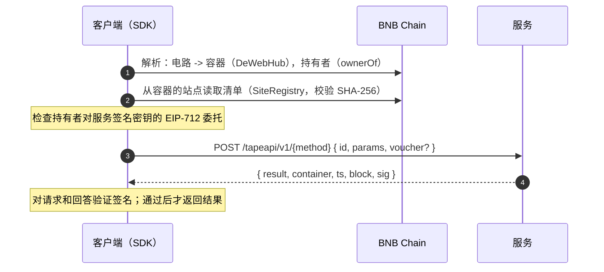

[English](README.md) | 中文

# TapeAPI

**Tape Out 一个电路，它的容器就是你的 API。** 每个回答都由它签名，任何人都能对照链上数据验证，容器之间还能通过端到端
加密的通道互相通信。

TapeAPI 是 BNB Chain 上 [TapeOut](https://tapeout.net) 生态的服务与通信层。在这个生态中，DeWEB 是网站，TapeSend 是
消息，**TapeAPI 是服务**。

[](https://github.com/BruceLanLan/tapeapi/actions/workflows/ci.yml)
[](LICENSE)
[](LICENSE-SPEC)
[](https://tapeapi.fun/docs/zh/)
[](https://tapeapi.fun/playground/)
[](https://tapeapi.fun/status/)

[English](README.md) · [指南](docs/guides/zh-CN/) · [规范](spec/) · [示例](examples/) · [手册](https://tapeapi.fun/docs/zh/) · [网站](https://tapeapi.fun) · [更新日志](CHANGELOG.md) · [路线图](docs/ROADMAP.md) · [参与贡献](CONTRIBUTING.md) · [行为准则](CODE_OF_CONDUCT.md)

> **状态：pre-alpha（v0.4.0）。** 免费层不需要我们的任何合约，运行在 TapeOut 已部署的合约之上。
> 我们自己的合约（付费调用托管合约、服务目录、ChannelBus）**未经第三方审计**；ChannelBus 已部署（地址见下文）。
> 接口仍可能变化。下文的 TAP 编号是向 TapeKit 维护者**提议**的编号，尚未正式分配。

## 30 秒试用线上服务

一个免费的公共服务运行在 `https://api.tapeapi.fun`，TapeOut 名称为 `11.1013.tape`。向它询问 BNB 价格：

```bash
curl -s https://api.tapeapi.fun/tapeapi/v1/bnbUsd -H 'content-type: application/json' -d '{"id":"1","params":{}}'
```

curl 会显示签名信封（`result`、`container`、`ts`、`block`、`sig`），但不会检查它。SDK 会检查。
这些包尚未发布到 npm，所以先准备一次仓库（Node.js 20 或更高版本）：

```bash
git clone https://github.com/BruceLanLan/tapeapi.git && cd tapeapi && npm install
```

或者只把 SDK 装进你自己的项目，从 GitHub 版本发布页安装（不是 npm 仓库）：

```bash
npm install https://github.com/BruceLanLan/tapeapi/releases/download/v0.4.0/tapeapi-sdk-0.4.0.tgz
```

把下面的代码保存为 `try.mjs`，**放在 `tapeapi` 目录之内**（`@tapeapi/sdk` 通过仓库的 workspace 解析；保存在其它任何位置
的脚本都会以 `ERR_MODULE_NOT_FOUND` 失败），然后运行 `node try.mjs`：

```js
import { createTapeAPI } from '@tapeapi/sdk'

const api = createTapeAPI({
  rpcUrls: ['https://bsc-dataseed.bnbchain.org', 'https://bsc-dataseed1.defibit.io', 'https://bsc-dataseed1.ninicoin.io'],
  quorum: 2,
})
const svc = await api.resolve('11.1013.tape')             // 名称 -> 容器 -> 链上清单 -> 持有者的委托
const { result, verified } = await api.call(svc, 'bnbUsd', {})
console.log(result, verified)                              // 只有签名检查通过后 verified 才为 true
```

完全不想安装：[调试台](https://tapeapi.fun/playground/)在浏览器里运行同一份 SDK。公共服务的全部方法列在
[公共 API](docs/guides/zh-CN/public-api.md) 中。

## 在 Claude、Cursor 等 MCP 客户端中使用

同样的八个方法也是 [MCP](https://modelcontextprotocol.io) 工具，地址是 `https://api.tapeapi.fun/mcp`（Streamable
HTTP，无需密钥）。在 Claude 里，到 **Settings > Connectors > Add custom connector** 添加；在 Cursor 里，写进 `mcp.json`：

```json
{ "mcpServers": { "tapeapi": { "url": "https://api.tapeapi.fun/mcp" } } }
```

每个结果都由服务在链上委托的密钥签名，并附带回执和核验链接，任何人都能对照链上核验。远程服务器只负责签名；SDK 发布包里的
本地命令 `tapeapi-mcp` 会在模型看到结果之前自己核验每个回答。各客户端的配置、回执与限制见
[MCP 指南](docs/guides/zh-CN/mcp.md)。

---

## 为什么需要 TapeAPI

今天的 API 等于一个 URL 加一个账号再加信任。你在供应商那里注册，信任它的服务器所说的一切，而供应商随时可以更改回答、
价格或规则。

TapeAPI 把服务的身份变成链上对象，把每个回答变成一份签名声明：

- **服务就是电路。** 谁持有电路 NFT，谁就拥有该服务。转让 NFT，服务随之转移；没有人能夺走这个名字。
- **每个回答都带签名，并绑定到你的请求。** 客户端对照电路持有者在链上授权的密钥检查签名。被篡改、被重放或未签名的回答
  是错误，永远不会是结果。
- **无需注册，无需 API 密钥。** 免费方法直接调用。付费方法用链下凭证支付，凭证分批在链上结算；协议收取**零费用**。
- **容器之间的私密通道。** 两个服务、两个智能体或两个应用可以打开一条端到端加密的通道，由中继或链本身承载，承载方
  永远只能看到密文。

## 工作原理



1. **身份（TAP-20）。** 电路的 ERC-6551 容器就是服务身份。其站点存有清单 `.well-known/tapeapi.json`：端点、方法、价格
   以及服务的签名密钥。
2. **委托。** 电路持有者签署一份 EIP-712 委托，写明那把签名密钥和到期时间。其域锚定在 TapeOut 已部署的 DeWebHub 上，
   因此在我们的任何合约存在之前，服务就能工作。
3. **签名信封（TAP-21）。** 每个回答，无论成功还是错误，都对一个摘要签名，该摘要绑定容器、请求 id、方法与参数、结果
   以及时间戳。
4. **支付（TAP-22）。** 付费方法接受累计凭证，从每个提供者各自的托管通道中结算。
5. **通道（TAP-26、TAP-27）。** 持有者授权的通道密钥、X3DH 式握手和 ChaCha20-Poly1305 帧，经由中继或 ChannelBus
   （一个无状态、只发事件的合约）传输。

## 快速开始

要求：Node.js 20 或更高版本。这些包尚未发布到 npm；请使用本仓库。

```bash
git clone https://github.com/BruceLanLan/tapeapi.git
cd tapeapi
npm install
```

### 调用服务

在本地运行最小示例服务（它通过公共节点读取 BNB Chain）：

```bash
node examples/reader-service/index.mjs        # listens on :8787 with a throwaway signing key
```

在代码中调用它。SDK 会解析清单、调用方法，并在返回之前验证签名：

```js
import { createTapeAPI } from '@tapeapi/sdk'

const api = createTapeAPI({ dev: true })                           // dev：允许本地 http:// 服务
const svc = await api.resolve({ dev: 'http://127.0.0.1:8787' })
const { result, verified } = await api.call(svc, 'blockNumber', {})
console.log(result.blockNumber, verified)
```

在主网上，按 TapeOut 名称、容器地址或电路解析，并使用至少两个必须达成一致的 RPC 节点：

```js
const api = createTapeAPI({
  rpcUrls: ['https://bsc-dataseed.bnbchain.org', 'https://bsc-dataseed1.defibit.io', 'https://bsc-dataseed1.ninicoin.io'],
  quorum: 2,
})
const svc = await api.resolve('0x<container>')                     // 或 '11.1013.tape'，或 { circuits: '0x…', tokenId: '11' }
const { result } = await api.call(svc, 'blockNumber', {})
```

也可以用 curl 调用，之后再手动验证（[方法](docs/guides/zh-CN/consume.md#不使用-sdk-进行验证)）：

```bash
curl -s -X POST http://127.0.0.1:8787/tapeapi/v1/blockNumber \
  -H 'content-type: application/json' -d '{"id":"1","params":{}}'
```

### 运行服务

把任意函数，或任意现有的 REST API，包装成签名方法：

```js
import { createProvider } from '@tapeapi/server'

const provider = createProvider({
  manifest,                                  // 你的 tapeapi.json
  signerKey: process.env.SIGNER_KEY,         // 电路持有者所委托的密钥
  rpcUrls: [/* >= 2 个 BNB Chain 节点 */], quorum: 2,
  methods: {
    blockNumber: async (_params, ctx) => ({ blockNumber: ctx.block }),
    quote: async ({ symbol }) => fetch(`https://your.api/quote/${symbol}`).then((r) => r.json()),
  },
})
await provider.listen(8787)                  // Node；在 Cloudflare Workers 上使用 provider.handleRequest(request)
```

上线需要：一个已开通容器的电路、一份由其持有者签署的委托，以及写入容器站点的清单。[持有者控制台](https://tapeapi.fun/console/)
可以在手机钱包中完成这三件事。见[运行服务](docs/guides/zh-CN/provide.md)。

## 功能

| | |
|---|---|
| **可验证的回答** | 签名信封绑定到确切的请求；签名者对照链上持有者检查；新鲜度窗口；一个独立的 Python 实现检查测试向量。 |
| **法定人数读取** | 链上读取要求每个作答节点都一致，绝不采用多数决。`callQuorum` 只有在独立提供者返回相同字节时才接受结果。 |
| **按次付费** | 累计 EIP-712 凭证、会话密钥、带提款冷却期的托管合约、零协议费，以及由每个提供者自行选择的可选自愿贡献。 |
| **私密通道** | TAP-26：双向认证、前向保密、每个方向独立的密钥、防重放与防乱序；中继或链上传输。 |
| **私密群组** | TAP-27：最多 32 个容器，由群主管理的纪元，加密的成员名册，每个发送者单独签名。 |
| **不丢消息的链上传输** | ChannelBus 读取器宁可停住也不跳过：它能应对公共节点的历史限制、结果数量上限和故障，并对任何读不到的内容发出警告。经过数千次随机化对抗运行的测试。 |
| **AI 智能体** | `exposeTapeAPI` 把任何服务变成供浏览器内智能体使用的 WebMCP 工具；每个回答都经过签名检查，付费方法需要显式预算。 |
| **随处运行** | Node、Cloudflare Workers（Fetch API）、浏览器和 DeWEB 站点；三个小巧且经过审计的依赖（`@noble/curves`、`@noble/hashes`、`@noble/ciphers`）。 |

## 包与仓库结构

| 路径 | 内容 |
|---|---|
| [`sdk/`](sdk/) | `@tapeapi/sdk`：解析、调用、支付、验证、通道、群组、WebMCP 桥接。 |
| [`server/`](server/) | `@tapeapi/server`：提供者运行时（Node `listen` 与 Fetch `handleRequest`）、计量、限流。 |
| [`contracts/`](contracts/) | Solidity 合约及 Foundry 测试：`TapeAPIEscrow`、`ServiceDirectory`、`ChannelBus`。 |
| [`spec/`](spec/) | 各 TAP，中英双语（以英文为准），附测试向量和一个独立的 Python 验证器。 |
| [`examples/`](examples/) | 可运行的服务：最小读取服务、Web2 适配器、DeFi 读取、经证明的跨链读取、一个中继、一个 Cloudflare Worker、一个 WebMCP 演示。 |
| [`conformance/`](conformance/) | 一个黑盒测试套件，任何提供者或中继实现都可以针对某个 URL 运行它。 |
| [`site/`](site/) | 网站和持有者控制台（`site/console/`），均为普通静态文件。 |
| [`docs/`](docs/) | 指南和设计说明；从 [`docs/README.md`](docs/README.md) 开始阅读。 |

## 规范

| TAP | 标题 | 一句话概括 |
|---|---|---|
| [TAP-1](spec/TAP-1.md) | TAP 流程 | 类型、状态、编号和必备章节。 |
| [TAP-20](spec/TAP-20.md) | 服务身份与清单 | 服务就是电路；`.well-known/tapeapi.json`；持有者的 EIP-712 委托；解析算法。 |
| [TAP-21](spec/TAP-21.md) | 签名响应信封 | `POST {live}/{method}`；`TAPI-1/resp/v2` 摘要；规范 JSON；错误码。 |
| [TAP-22](spec/TAP-22.md) | 计量支付 | 累计凭证、每个提供者各自的托管通道、零协议费。 |
| [TAP-23](spec/TAP-23.md) | 经证明的读取（Attested Read） | 对其它链的签名、固定区块的读取，由多个独立提供者达成一致。 |
| [TAP-24](spec/TAP-24.md) | 意图询价（Intent RFQ） | 无需跨链桥的跨链兑换的签名报价（在质押机制存在之前冻结）。 |
| [TAP-25](spec/TAP-25.md) | 电路验证方法（Circuit-Verified Methods） | 绑定到某个电路的方法，由该电路的链上 `eval()` 裁决争议。 |
| [TAP-26](spec/TAP-26.md) | Tape Channel | 容器之间的端到端加密通道；中继与 ChannelBus。 |
| [TAP-27](spec/TAP-27.md) | Tape Group | 最多 32 个容器的私密群组。 |

## 链上地址（BNB Chain，chainId 56）

| 合约 | 地址 | 所有者 |
|---|---|---|
| DeWebHub | `0xe61A9C7213a6Aa616C246a2B569e555B417b25ee` | TapeOut（已部署） |
| SiteRegistry | `0xd006ffdd5Ae313B17729621A00999cD3C71CE5e6` | TapeOut（已部署） |
| 处理器工厂 | `0x68224F668083c29e9800Be2a646d42d18cedF7e2` | TapeOut（已部署） |
| BEM 代币 | `0x5ce033b2bfca3af30b3e8c8457deaf776a8b695a` | TapeOut（已部署） |
| ChannelBus | [`0x486110c35d9b90a9d6D85c8063A065f9e7b6b707`](https://bscscan.com/address/0x486110c35d9b90a9d6D85c8063A065f9e7b6b707) | TapeAPI（无所有者、无状态、不可升级） |
| TapeAPIEscrow、ServiceDirectory | *未部署* | TapeAPI |

## 质量

- **测试：** 约 710 个 JavaScript 测试（`npm test`）、169 个 Foundry 测试（`cd contracts && forge test`），以及由签名、
  哈希和编码的独立 Python 实现执行的 102 项检查（`python3 spec/vectors/verify.py`）。
- **对抗性评审：** 共十二轮评审，每个问题都有书面记录、一个失败的测试和一个修复；链上读取器由一个随机化测试覆盖，
  其中包括故障、说谎和嘈杂的节点、重组以及房间变化。
- **记录真实情况：** 真实 BNB Chain 节点的回答（拒绝历史查询、结果数量上限、落后的后端）从主网录制，并在测试中回放。
- **尚未完成：** 合约的外部审计。请不要在托管合约中存放你无法承受损失的资金。

## 安全

请按照 [SECURITY.md](SECURITY.md) 的说明私下报告漏洞。请不要为安全问题提交公开 issue。

## 参与贡献

欢迎提交 issue 和 pull request；见 [CONTRIBUTING.md](CONTRIBUTING.md)。规范变更需经过 [TAP-1](spec/TAP-1.md) 中的
TAP 流程。三套测试必须全部通过。

## 许可证

代码采用 MIT 许可（[LICENSE](LICENSE)）：`contracts/`、`sdk/`、`server/`、`examples/`、`conformance/`、`scripts/`、`site/`。
`spec/` 中的规范采用 CC0-1.0（[LICENSE-SPEC](LICENSE-SPEC)）。

## 致谢

为 TapeOut 构建服务层的想法，即“DeWEB 是网站，TapeSend 是消息，TapeAPI 是服务”，来自
**[@Theairresearch](https://x.com/Theairresearch/status/2101640697426448632)**。TapeAPI 所获任何收入的 10% 将永久归其所有。

构建于 [TapeOut](https://tapeout.net) 与 [TapeKit](https://github.com/TapeOutProtocol/TapeKit) 之上。
