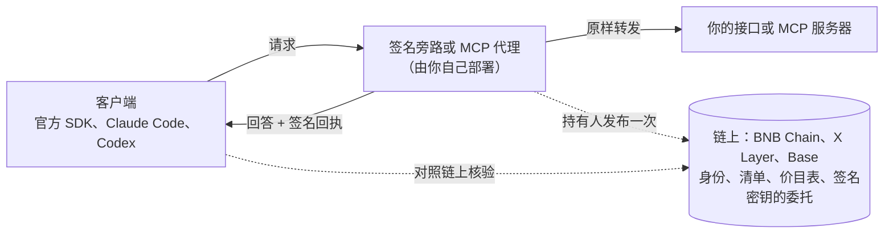

[English](README.md) | 中文

# TapeAPI

**每次 AI 调用，都附一张签名回执。** 在你的 OpenAI 或 Anthropic 兼容接口前面加一个旁路，每个回答都会带上一张任何人都能核验的
回执：谁回答的、回答的是哪个请求、回了哪些字节、声称用了多少 token、收多少钱。你的用户照旧用官方 SDK，只改 base URL，
不改代码。

TapeAPI 是 [TapeOut](https://tapeout.net) 的签名 API 层。同一套链上身份和签名，也用在 MCP 工具、容器之间端到端加密的通道与
群聊上，支持 BNB Chain、X Layer 和 Base。

[](https://github.com/BruceLanLan/tapeapi/actions/workflows/ci.yml)
[](LICENSE)
[](LICENSE-SPEC)
[](https://tapeapi.fun/docs/zh/)
[](https://tapeapi.fun/playground/)
[](https://tapeapi.fun/status/)

[English](README.md) · [网站](https://tapeapi.fun) · [手册](https://tapeapi.fun/docs/zh/) · [指南](docs/guides/zh-CN/) · [规范](spec/) · [示例](examples/) · [更新日志](CHANGELOG.md) · [路线图](docs/ROADMAP.md)

> **状态：预发布（v1.0.0-rc.2）。** 今天上线的一切都免费。1.0 之前接口仍可能变化。付费通道（TAP-22）是实验性的，没有部署。
> 所有代码和合约都没有经过第三方审计。

## 从这里开始

| 你是 | 头 5 分钟做什么 | 指南 |
|---|---|---|
| **AI 服务方或中转站**（new-api、网关、自建模型） | 在 [`examples/new-api-sidecar`](examples/new-api-sidecar/) 里 `docker compose up`，到[持有人操作台](https://tapeapi.fun/console/)发布价目表，把用户的 base URL 指向旁路 | [AI 服务方指南](docs/guides/zh-CN/ai-providers.md) |
| **MCP 服务器作者** | 在你的服务器前面跑[签名代理](examples/mcp-proxy/)，再用操作台发布清单 | [Tape out 你的 MCP 服务器](docs/guides/zh-CN/mcp.md#tape-out-你自己的-mcp-服务器) |
| **应用开发者** | 跑一遍下面的示例；用 `createVerifyingFetch` 核验 AI 回执；通道和群聊从 [`examples/group-chat`](examples/group-chat/) 开始 | [调用服务](docs/guides/zh-CN/consume.md) · [私密通道](docs/guides/zh-CN/channels.md) · [群聊](docs/guides/zh-CN/groups.md) |
| **TapeOut 电路持有人** | 开通电路的容器，然后在操作台里生成服务密钥、签委托、发布清单 | [运行服务](docs/guides/zh-CN/provide.md) |
| **Claude、Cursor 等 MCP 客户端的用户** | 把 `https://api.tapeapi.fun/mcp` 添加为连接器 | [MCP 指南](docs/guides/zh-CN/mcp.md) |

## 试一试

**一个带签名的回答。** 公共服务 `11.1013.tape` 提供 8 个免费的读取方法，每个都钉在一个 BNB Chain 区块上：

```bash
curl -s https://api.tapeapi.fun/tapeapi/v1/bnbUsd -H 'content-type: application/json' -d '{"id":"1","params":{}}'
```

curl 只显示签名信封，不做任何核对；核对交给 SDK。SDK 还没发到 npm，从 GitHub Release 安装（Node.js 20 或以上）：

```bash
npm install https://github.com/BruceLanLan/tapeapi/releases/download/v1.0.0-rc.2/tapeapi-sdk-1.0.0-rc.2.tgz
```

```js
// try.mjs：node try.mjs
import { createTapeAPI, rpcUrlsFor } from '@tapeapi/sdk'

const api = createTapeAPI({ rpcUrls: rpcUrlsFor(56) })   // 3 家不同运营方的节点，2 家一致才采信
const service = await api.resolve('11.1013.tape')         // 名字、容器、链上清单、持有人委托
const { result, verified } = await api.call(service, 'bnbUsd', {})
console.log(result.bnbUsd, verified)                      // 验签通过才为 true
```

**AI 回执。** 把 `createVerifyingFetch` 接进官方 OpenAI SDK（`npm install openai`；Anthropic SDK 同样接受 `fetch`）。
把 `42.1013.tape` 换成服务方的 TapeOut 名字：

```js
import OpenAI from 'openai'
import { createTapeAPI, rpcUrlsFor, ai } from '@tapeapi/sdk'

const api = createTapeAPI({ rpcUrls: rpcUrlsFor(56) })
const service = await api.resolve('42.1013.tape')        // AI 服务方的名字（示例）
const { baseUrl } = service.manifest.ai.endpoints.find((e) => e.format === 'openai-chat')
const client = new OpenAI({
  baseURL: baseUrl,                                      // 服务方发布在链上的地址
  apiKey: process.env.API_KEY,                           // 你在该服务方的密钥，照旧
  fetch: ai.createVerifyingFetch({ api, service }),      // 核验每张回执，不通过就抛错
})
const r = await client.chat.completions.create({ model: 'gpt-4o-mini', messages: [{ role: 'user', content: 'Hello' }] })
console.log(r.choices[0].message.content)
```

链上还没有外部服务方发布价目表，所以这段代码是对 [`examples/ai-proxy`](examples/ai-proxy/) 里的参考旁路（本地开发模式）
实际跑通的；接真实服务方时只换名字。

**Claude Code 和 Codex** 自己读不到回执。在本机开一个核验代理，再把它们指过去：

```bash
npx -y --package=https://github.com/BruceLanLan/tapeapi/releases/download/v1.0.0-rc.2/tapeapi-sdk-1.0.0-rc.2.tgz tapeapi-verify 42.1013.tape
ANTHROPIC_BASE_URL=http://127.0.0.1:8790 claude          # Codex：OPENAI_BASE_URL=http://127.0.0.1:8790/v1
```

**MCP。** 同样的 8 个读取方法也是 MCP 工具，地址是 `https://api.tapeapi.fun/mcp`，每个结果都带签名回执：

```bash
claude mcp add --transport http tapeapi https://api.tapeapi.fun/mcp
```

什么都不想装：[调试台](https://tapeapi.fun/playground/)在浏览器里跑同一个 SDK。

## 各部分怎么配合



| 层 | 是什么 | 规范 |
|---|---|---|
| **身份** | 一枚 TapeOut 电路的 ERC-6551 容器。谁持有电路，谁就拥有这个服务；电路转手，服务跟着走。 | [TAP-20](spec/TAP-20.md) |
| **清单** | 容器链上站点里的 `.well-known/tapeapi.json`：接口地址、方法、AI 价目表、MCP 工具定义的哈希、签名密钥，以及持有人对这把密钥的委托。 | [TAP-20](spec/TAP-20.md) |
| **签名回答与回执** | 每个回答都有签名，并和它的请求绑定；AI 调用另有一张用量回执。 | [TAP-21](spec/TAP-21.md) |
| **通道与群聊** | 端到端加密，经中继或 ChannelBus 传递；承载方只看得到密文。 | [TAP-26](spec/TAP-26.md)、[TAP-27](spec/TAP-27.md) |

## 回执能证明什么，不能证明什么

回执能证明：**谁回答的**（电路持有人在链上委托的密钥）、**回答的是哪个请求**（请求的确切字节）、**回了哪些字节**，以及
**声称的用量和价格**（按链上价目表计算）。

回执**不证明实际跑的是哪个模型**：服务方可以把便宜模型的回答标成贵的。签名带来的是可追责：回执无法抵赖，任何人用
[抽检探针](examples/spot-check/)发测试请求并公开结果，都会留下证据。

## 现状与承诺

- **已上线，免费，无需注册：** 公共服务 `api.tapeapi.fun`（8 个方法）和它的 MCP 端点，公共中继 `relay.tapeapi.fun`
  （`relaySend`、`relayHandshake`、`relayRecv`），[ChannelBus](https://bscscan.com/address/0x486110c35d9b90a9d6D85c8063A065f9e7b6b707)，
  以及网站上的[持有人操作台](https://tapeapi.fun/console/)、[回执核验页](https://tapeapi.fun/verify/)、
  [调试台](https://tapeapi.fun/playground/)和[状态页](https://tapeapi.fun/status/)。
- **可用，由你自己部署：** AI 签名旁路与 new-api 一键包、MCP 签名代理、`tapeapi-verify`、`tapeapi-mcp`、抽检探针，
  以及 SDK 里的群聊一步投递（`deliverGroupUpdate`）。
- **实验性，未部署：** 付费通道与托管合约（[TAP-22](spec/TAP-22.md)）、服务目录、可由电路验证的方法
  （[TAP-25](spec/TAP-25.md)）。它们都不在 1.0 的稳定承诺里。
- **1.0 承诺什么：** 按 1.0 文档写的代码，在所有 1.x 版本里都能继续工作；除了标注 `@experimental` 或 `@internal` 的，
  其余全部是稳定的。从 0.x 升级：[升级到 1.0](docs/guides/zh-CN/upgrade-1.0.md)。
- **我们不做的事：** 不替任何人托管旁路（它会经手你用户的 API 密钥，只能你自己部署）；不发币；不帮任何人绕开上游服务商的
  封禁或地区限制（TapeAPI 只面向在上游条款范围内经营的服务方）。
- **链：** BNB Chain（chainId 56）什么都能做，将来的支付也只在这条链上。X Layer（196）和 Base（8453）只读：身份、解析、
  回执和 MCP 核验。X Layer 只有两家独立的 RPC 运营方。
- **没有经过第三方审计。** 测试：约 1,140 个 JavaScript 测试（`npm test`）、169 个合约测试（`forge test`），另有一份独立的
  Python 实现核对每一处签名、哈希和编码（`python3 spec/vectors/verify.py`）。

## 隐私，如实说

- **受保护的：** 通道和群聊的内容（端到端加密）；AI 回执只带哈希，经 SDK 或 `tapeapi-verify` 发出的请求还会追加 128 位
  随机空白，短提示词没法靠猜哈希对上；MCP 核验链接默认只带哈希；SDK 的 `busPrivacyReader` 读取整个 ChannelBus 后在本地
  筛选，节点看不出你的房间。
- **藏不住的：** 服务方看得到它处理的一切（你的请求、IP 和 API 密钥）；公共 RPC 节点看得到你的 IP 和你在核验哪个服务；
  中继和链看得到通道的房间、时间和大小；链上的一切都是公开的，将来的付款也一样。

## 费用

无强制协议费；默认 1% 维护贡献，任何服务方都可以关闭；运营方没有费率开关。这 1% 只在付费通道结算时从服务方所得中扣，
用户的价格不变。付费托管合约尚未部署，所以**今天所有调用都不收费**。AI 服务方照旧在链下向用户收费；清单里的价格是公开的
声明，不经过结算。详见 [docs/FEES.md](docs/FEES.md)。

## 规范

| TAP | 标题 | 状态 |
|---|---|---|
| [TAP-1](spec/TAP-1.md) | TAP 流程与状态 | Draft |
| [TAP-20](spec/TAP-20.md) | 服务身份与清单，含 AI 价目表与多链名字 | Draft，目标 Stable (v1) |
| [TAP-21](spec/TAP-21.md) | 签名响应信封，含 AI 用量回执 | Draft，目标 Stable (v1) |
| [TAP-22](spec/TAP-22.md) | 计量支付：凭证与托管 | Experimental（实验性） |
| [TAP-23](spec/TAP-23.md) | 多家交叉验证的读取 | Draft，目标 Stable (v1) |
| [TAP-24](spec/TAP-24.md) | 跨链意图询价 | Withdrawn（已撤回） |
| [TAP-25](spec/TAP-25.md) | 可由电路验证的方法 | Experimental（实验性） |
| [TAP-26](spec/TAP-26.md) | 容器间的私密通道 | Draft，目标 Stable (v1) |
| [TAP-27](spec/TAP-27.md) | 最多 32 个容器的私密群聊 | Draft，目标 Stable (v1) |

规范中英双语，以英文为准。TAP 编号已[提交给 TapeKit 维护者](https://github.com/TapeOutProtocol/TapeKit/issues/8)，尚未正式分配。

## 仓库

[`sdk/`](sdk/) `@tapeapi/sdk`（解析、调用、验签、AI 回执、通道、群聊、MCP）·
[`server/`](server/) `@tapeapi/server`（服务端、AI 旁路、MCP 代理）·
[`contracts/`](contracts/)（ChannelBus，以及实验性的托管合约和服务目录）·
[`spec/`](spec/)（各 TAP、测试向量、Python 验证器）· [`examples/`](examples/) ·
[`conformance/`](conformance/) · [`site/`](site/)（网站）· [`docs/`](docs/README.md)。
合约地址见[入门](docs/guides/zh-CN/introduction.md#链上地址)。

安全问题请按 [SECURITY.md](SECURITY.md) 私下报告。欢迎提 issue 和 pull request，见 [CONTRIBUTING.md](CONTRIBUTING.md) 与
[行为准则](CODE_OF_CONDUCT.md)。

## 许可证

代码采用 MIT（[LICENSE](LICENSE)）：`contracts/`、`sdk/`、`server/`、`examples/`、`conformance/`、`scripts/`、`site/`。
`spec/` 里的规范采用 CC0-1.0（[LICENSE-SPEC](LICENSE-SPEC)）。

## 致谢

为 TapeOut 做一个服务层的想法，也就是“DeWEB 是网站，TapeSend 是消息，TapeAPI 是服务”，来自
**[@Theairresearch](https://x.com/Theairresearch/status/2101640697426448632)**。TapeAPI 未来任何收入的 10% 永久归他们。

构建于 [TapeOut](https://tapeout.net) 与 [TapeKit](https://github.com/TapeOutProtocol/TapeKit) 之上。
