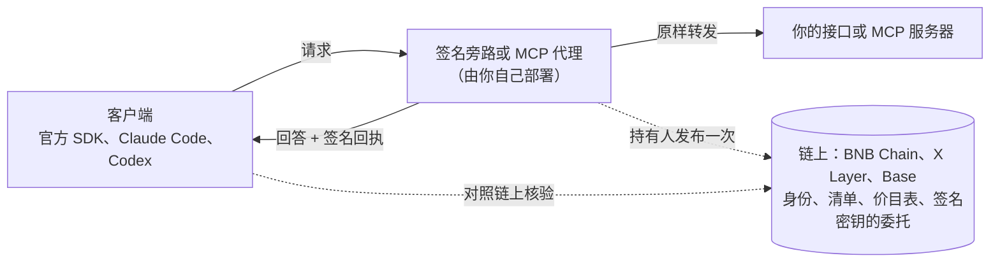

[English](README.md) | 中文

# TapeAPI

**每次 AI 调用，都附一张签名回执。** 在你的 OpenAI 或 Anthropic 兼容接口前面加一个旁路，每个回答都会带上一张任何人都能核验的
回执：谁回答的、回答的是哪个请求、回了哪些字节、声称用了多少 token、收多少钱。你的用户照旧用官方 SDK，只改 base URL，
不改代码。

TapeAPI 是 [TapeOut](https://tapeout.net) 的签名 API 层。同一套链上身份和签名，也用在 MCP 工具、容器之间端到端加密的通道与
群聊上，支持 BNB Chain、X Layer 和 Base。

[](https://github.com/BruceLanLan/tapeapi/actions/workflows/ci.yml)
[](LICENSE)
[](LICENSE-SPEC)
[](https://tapeapi.fun/docs/zh/)
[](https://tapeapi.fun/playground/)
[](https://tapeapi.fun/status/)

[English](README.md) · [网站](https://tapeapi.fun) · [手册](https://tapeapi.fun/docs/zh/) · [指南](docs/guides/zh-CN/) · [规范](spec/) · [示例](examples/) · [更新日志](CHANGELOG.md) · [路线图](docs/ROADMAP.md)

> **1.7：容器代理（Container Agent，实验性，阶段 0）。** 容器 + 代理 = 容器代理。容器持有人签一张授权书，写明哪个代理可以替这个容器做哪件任务；代理接任务、交付；委托方验收；付款是一笔普通转账，任何人都可以独立核验。不需要新合约。**边界如实说：**阶段 0 没有链上强制执行，授权书不限制花钱（写了金额的授权书会被拒绝）；子路径 `@tapeapi/sdk/agent` 是实验性的，不受 1.x 兼容承诺约束；本项目没有经过第三方审计。[1.7 新增](#17-新增) · [容器代理指南](docs/guides/zh-CN/container-agents.md)

> **状态：正式版（1.7.1）。** 今天上线的一切都免费。1.0 起遵循语义化版本：破坏性修改只在 2.0。付费通道（TAPI-22）是实验性的，没有部署。
> 所有代码和合约都没有经过第三方审计。**安全说明：**1.0.0 至 1.4.0 的流式 AI 回执核验，在特定分块下可能把被截断或被注入内容的流显示为“已核验”；1.5.0 已修复，请升级（[更新说明](https://github.com/BruceLanLan/tapeapi/releases/tag/v1.5.0)）。

## 能做什么

- **签名回答与回执**（1.0 起稳定）。每个回答都由电路持有人在链上委托的密钥签名，并与它的请求绑定；AI 调用另有一张用量回执，按链上价目表计价。[调用服务](docs/guides/zh-CN/consume.md) · [AI 服务方指南](docs/guides/zh-CN/ai-providers.md)
- **MCP 工具**（1.0 起稳定）。结果带签名和回执，工具定义的哈希钉在链上：有公共端点，有给你自己服务器用的签名代理，还有在本地逐个核验的 `tapeapi-mcp`。[MCP 指南](docs/guides/zh-CN/mcp.md)
- **私密通道与群聊**（1.0 起稳定）。容器之间端到端加密，经中继或 ChannelBus 传递。[私密通道](docs/guides/zh-CN/channels.md) · [群聊](docs/guides/zh-CN/groups.md)
- **与 TapeOut 官方 TAP-10 一致**（1.4 至 1.5，实验性）。可选的一致模式 `conform: 'tap10'` 在解析、全链解析、消息路径与 strict 读取上按 TAP-10 执行；2.0 之前默认行为不变。[TAP-10 一致模式](docs/guides/zh-CN/upgrade-1.0.md#tap-10-一致模式14实验性)
- **流式 AI 回执，用量也能核验**（1.5 至 1.6）。1.5 起，被截断或被追加内容的流，回执核验不再通过；1.6 新增可选的 `requestUsage`，把流式 OpenAI Chat 回答的用量放进签名的流里，像整段回答一样核对（它不证明上游自己的计数）。[流式 Chat 的用量：三条路](docs/guides/zh-CN/ai-providers.md#流式-chat-的用量三条路)
- **容器代理**（1.7，实验性）。持有人签名的授权书、从报价到验收的任务线程、只读的付款核验；不需要新合约，阶段 0 不做强制执行。[容器代理](docs/guides/zh-CN/container-agents.md)

## 1.7 新增

容器 + 代理 = 容器代理，阶段 0。以下全部是实验性的，不受 1.x 兼容承诺约束；格式跟随公开讨论 TapeOutProtocol/TAPs#40（授权书）与 #41（任务协议），可能随之改变。

- **`@tapeapi/sdk/agent`。** 四种持有人签名的 EIP-712 消息：授权书（`Mandate`）、任务报价（`TaskOffer`）、验收裁定（`TaskVerdict`）、撤销（`MandateRevocation`）。`createAgentKit` 核验授权书、任务线程（报价 → 接受 → 授权书 → 交付 → 验收 → 撤销）和证据，并标出“自雇自”（`selfHire`）。`createPaymentKit` 生成付款订单，只构造普通的 `transfer`（从不构造 `approve`），收款人只从链上读取，按 TAP-10 §19 的 15 步只读核验付款。`forWallet(td, { chainId, hub })`：每份待签数据交给钱包之前都必须经过它；它去掉给控制台看的提示，并拒绝链或 hub 与预期不符的载荷。
- **`tapeapi-verify task <thread.json> [--payment <收款人> <序号>] [--rpc <url>...]`**：从命令行核验一条任务线程，加 `--payment` 时连付款一起核验。
- **[`examples/agent-service`](examples/agent-service/)**：一个代理运行时和一个离线跑完整个流程的雇佣脚本。测试向量 `spec/vectors/container-agent.json` 让向量集从 480 项增加到 514 项，独立的 Python 实现与 SDK 一致。
- **维护贡献的合约上限降到 20%**（原为 50%）；默认仍是 1%，服务方可以设为 0。托管合约仍未部署、未经审计，没有线上通道受影响。
- **托管资产。** [TAPI-22](spec/TAPI-22.md) 新增说明性的一节，讲托管合约将持有哪些代币：首先是 USDT 锚定币，BEM 与 WBNB 按需；不持有原生 BNB（以 WBNB 持有）。

3 分钟跑起来：在已安装依赖的仓库检出根目录运行（克隆与 `npm ci` 两行见[试一试](#试一试)）：

```bash
node examples/agent-service/hire.mjs
```

它会打印每一步钱包将被要求签什么、线程核验结果（`enforcement none`）和验收裁定；全部发生在 SDK 的假链上，用的是测试密钥：不联网、不碰真实钱包、不花钱。加 `--same-holder` 演示“自雇自”如何被标出；加 `--pay` 增加付款分支，只生成未签名的交易。

## 从这里开始

| 你是 | 头 5 分钟做什么 | 指南 |
|---|---|---|
| **AI 服务方或中转站**（new-api、网关、自建模型） | 在 [`examples/new-api-sidecar`](examples/new-api-sidecar/) 里 `docker compose up`，到[持有人操作台](https://tapeapi.fun/console/)发布价目表，把用户的 base URL 指向旁路 | [AI 服务方指南](docs/guides/zh-CN/ai-providers.md) |
| **MCP 服务器作者** | 在你的服务器前面跑[签名代理](examples/mcp-proxy/)，再用操作台发布清单 | [Tape out 你的 MCP 服务器](docs/guides/zh-CN/mcp.md#tape-out-你自己的-mcp-服务器) |
| **应用开发者** | 跑一遍下面的示例；用 `createVerifyingFetch` 核验 AI 回执；通道和群聊从 [`examples/group-chat`](examples/group-chat/) 开始 | [调用服务](docs/guides/zh-CN/consume.md) · [私密通道](docs/guides/zh-CN/channels.md) · [群聊](docs/guides/zh-CN/groups.md) |
| **TapeOut 电路持有人** | 开通电路的容器，然后在操作台里生成服务密钥、签委托、发布清单 | [运行服务](docs/guides/zh-CN/provide.md) |
| **Claude、Cursor 等 MCP 客户端的用户** | 把 `https://api.tapeapi.fun/mcp` 添加为连接器 | [MCP 指南](docs/guides/zh-CN/mcp.md) |
| **想为容器雇一个代理，或自己做代理**（实验性） | 在仓库检出里运行 `node examples/agent-service/hire.mjs`，看每一步要钱包签什么 | [容器代理](docs/guides/zh-CN/container-agents.md) |

## 试一试

**一个带签名的回答。** 公共服务 `11.1013.tape` 提供 8 个免费的读取方法，每个都钉在一个 BNB Chain 区块上：

```bash
curl -s https://api.tapeapi.fun/tapeapi/v1/bnbUsd -H 'content-type: application/json' -d '{"id":"1","params":{}}'
```

curl 只显示签名信封，不做任何核对；核对交给 SDK。SDK 还没发到 npm，从 GitHub Release 安装（Node.js 20 或以上）：

```bash
npm install https://github.com/BruceLanLan/tapeapi/releases/download/v1.7.1/tapeapi-sdk-1.7.1.tgz
```

服务端包（`@tapeapi/server`：服务提供方、AI 旁路、MCP 代理）依赖这个 SDK，而 SDK 也不在 npm 上，所以单独安装服务端包会报 404：
请用一条命令同时安装两者，`npm install https://github.com/BruceLanLan/tapeapi/releases/download/v1.7.1/tapeapi-sdk-1.7.1.tgz https://github.com/BruceLanLan/tapeapi/releases/download/v1.7.1/tapeapi-server-1.7.1.tgz`。

```js
// try.mjs：node try.mjs
import { createTapeAPI, rpcUrlsFor } from '@tapeapi/sdk'

const api = createTapeAPI({ rpcUrls: rpcUrlsFor(56) })   // 3 家不同运营方的节点，2 家一致才采信
const service = await api.resolve('11.1013.tape')         // 名字、容器、链上清单、持有人委托
const { result, verified } = await api.call(service, 'bnbUsd', {})
console.log(result.bnbUsd, verified)                      // 验签通过才为 true
```

**AI 回执。** 把 `createVerifyingFetch` 接进官方 OpenAI SDK（`npm install openai`；Anthropic SDK 同样接受 `fetch`）。
把 `42.1013.tape` 换成服务方的 TapeOut 名字：

```js
import OpenAI from 'openai'
import { createTapeAPI, rpcUrlsFor, ai } from '@tapeapi/sdk'

const api = createTapeAPI({ rpcUrls: rpcUrlsFor(56) })
const service = await api.resolve('42.1013.tape')        // AI 服务方的名字（示例）
const { baseUrl } = service.manifest.ai.endpoints.find((e) => e.format === 'openai-chat')
const client = new OpenAI({
  baseURL: baseUrl,                                      // 服务方发布在链上的地址
  apiKey: process.env.API_KEY,                           // 你在该服务方的密钥，照旧
  fetch: ai.createVerifyingFetch({ api, service }),      // 核验每张回执，不通过就抛错
})
const r = await client.chat.completions.create({ model: 'gpt-4o-mini', messages: [{ role: 'user', content: 'Hello' }] })
console.log(r.choices[0].message.content)
```

链上还没有外部服务方发布价目表，所以这段代码是对 [`examples/ai-proxy`](examples/ai-proxy/) 里的参考旁路（本地开发模式）
实际跑通的；接真实服务方时只换名字。

**Claude Code 和 Codex** 自己读不到回执。在本机开一个核验代理，再把它们指过去：

```bash
# 终端 1（会一直运行）。42.1013.tape 是示例名：换成 AI 服务方的 TapeOut 名字
npx -y --package=https://github.com/BruceLanLan/tapeapi/releases/download/v1.7.1/tapeapi-sdk-1.7.1.tgz tapeapi-verify 42.1013.tape
```

```bash
# 终端 2，macOS 或 Linux
ANTHROPIC_BASE_URL=http://127.0.0.1:8790 claude
OPENAI_BASE_URL=http://127.0.0.1:8790/v1 codex             # Codex（或 config.toml 里的 base_url）
```

```powershell
# 终端 2，Windows PowerShell
$env:ANTHROPIC_BASE_URL="http://127.0.0.1:8790"; claude
$env:OPENAI_BASE_URL="http://127.0.0.1:8790/v1"; codex
```

照原样运行 `tapeapi-verify 42.1013.tape` 会停在 “no file at /.well-known/tapeapi.json”：这个名字是示例名，链上没有以它发布的服务。
不依赖任何服务方、想看回执端到端核验通过，就在本仓库的检出里跑本地试跑（不需要密钥、电路，也不花钱），先在根目录安装一次依赖：

```bash
git clone https://github.com/BruceLanLan/tapeapi.git && cd tapeapi
npm ci --no-audit --no-fund
node examples/relay-trial/trial.mjs
```

自己要做 AI 服务？从[从零到上线](docs/guides/zh-CN/ai-providers.md#从零到上线)开始；服务方的检查工具 `tapeapi-doctor`（实验性）
在同一个发布包里。

**MCP。** 同样的 8 个读取方法也是 MCP 工具，地址是 `https://api.tapeapi.fun/mcp`，每个结果都带签名回执：

```bash
claude mcp add --transport http tapeapi https://api.tapeapi.fun/mcp
```

什么都不想装：[调试台](https://tapeapi.fun/playground/)在浏览器里跑同一个 SDK。

## 各部分怎么配合



| 层 | 是什么 | 规范 |
|---|---|---|
| **身份** | 一枚 TapeOut 电路的 ERC-6551 容器。谁持有电路，谁就拥有这个服务；电路转手，服务跟着走。 | [TAPI-20](spec/TAPI-20.md) |
| **清单** | 容器链上站点里的 `.well-known/tapeapi.json`：接口地址、方法、AI 价目表、MCP 工具定义的哈希、签名密钥，以及持有人对这把密钥的委托。 | [TAPI-20](spec/TAPI-20.md) |
| **签名回答与回执** | 每个回答都有签名，并和它的请求绑定；AI 调用另有一张用量回执。 | [TAPI-21](spec/TAPI-21.md) |
| **通道与群聊** | 端到端加密，经中继或 ChannelBus 传递；承载方只看得到密文。 | [TAPI-26](spec/TAPI-26.md)、[TAPI-27](spec/TAPI-27.md) |

## 回执能证明什么，不能证明什么

回执能证明：**谁回答的**（电路持有人在链上委托的密钥）、**回答的是哪个请求**（请求的确切字节）、**回了哪些字节**，以及
**声称的用量和价格**（按链上价目表计算）。

回执**不证明实际跑的是哪个模型**：服务方可以把便宜模型的回答标成贵的。签名带来的是可追责：回执无法抵赖，任何人用
[抽检探针](examples/spot-check/)发测试请求并公开结果，都会留下证据。

## 现状与承诺

- **已上线，免费，无需注册：** 公共服务 `api.tapeapi.fun`（8 个方法）和它的 MCP 端点，公共中继 `relay.tapeapi.fun`
  （`relaySend`、`relayHandshake`、`relayRecv`），[ChannelBus](https://bscscan.com/address/0x486110c35d9b90a9d6D85c8063A065f9e7b6b707)，
  以及网站上的[持有人操作台](https://tapeapi.fun/console/)、[回执核验页](https://tapeapi.fun/verify/)、
  [调试台](https://tapeapi.fun/playground/)和[状态页](https://tapeapi.fun/status/)。
- **可用，由你自己部署：** AI 签名旁路与 new-api 一键包、MCP 签名代理、`tapeapi-verify`、`tapeapi-mcp`、抽检探针，
  以及 SDK 里的群聊一步投递（`deliverGroupUpdate`）。
- **实验性，未部署：** 付费通道与托管合约（[TAPI-22](spec/TAPI-22.md)）、服务目录、可由电路验证的方法
  （[TAPI-25](spec/TAPI-25.md)）。它们都不在 1.0 的稳定承诺里。
- **实验性，在 SDK 里：** 容器代理（`@tapeapi/sdk/agent`，阶段 0，自 1.7 起），不受 1.x 兼容承诺约束。链上没有任何强制执行：
  授权书只是一份签名声明，不限制花钱。
- **1.0 承诺什么：** 按 1.0 文档写的代码，在所有 1.x 版本里都能继续工作；除了标注 `@experimental` 或 `@internal` 的，
  其余全部是稳定的。从 0.x 升级：[升级到 1.0](docs/guides/zh-CN/upgrade-1.0.md)。
- **我们不做的事：** 不替任何人托管旁路（它会经手你用户的 API 密钥，只能你自己部署）；不发币；不帮任何人绕开上游服务商的
  封禁或地区限制（TapeAPI 只面向在上游条款范围内经营的服务方）。
- **链：** BNB Chain（chainId 56）什么都能做，将来的支付也只在这条链上。X Layer（196）和 Base（8453）只读：身份、解析、
  回执和 MCP 核验。X Layer 只有两家独立的 RPC 运营方。
- **没有经过第三方审计。** 测试：JavaScript 测试（`npm test`）、合约测试（`forge test`），另有一份独立的 Python 实现核对每一处
  签名、哈希和编码（`python3 spec/vectors/verify.py`）；三者在每次推送时都由 CI 运行。

## 隐私，如实说

- **受保护的：** 通道和群聊的内容（端到端加密）；AI 回执只带哈希，经 SDK 或 `tapeapi-verify` 发出的请求还会追加 128 位
  随机空白，短提示词没法靠猜哈希对上；MCP 核验链接默认只带哈希；SDK 的 `busPrivacyReader`（实验性）读取整个 ChannelBus 后在本地
  筛选，节点看不出你的房间。
- **藏不住的：** 服务方看得到它处理的一切（你的请求、IP 和 API 密钥）；公共 RPC 节点看得到你的 IP 和你在核验哪个服务；
  中继和链看得到通道的房间、时间和大小；链上的一切都是公开的，将来的付款也一样。

## 费用

无强制协议费；默认 1% 维护贡献，任何服务方都可以关闭；运营方没有费率开关。这 1% 只在付费通道结算时从服务方所得中扣，
用户的价格不变。服务方也可以设得更高，但不超过合约上限 20%（1.7 起由 50% 降低）。付费托管合约尚未部署，所以**今天所有调用都不收费**。AI 服务方照旧在链下向用户收费；清单里的价格是公开的
声明，不经过结算。详见 [docs/FEES.md](docs/FEES.md)。

## 规范

这些是 TapeAPI 自己的规范，不是 TAP。TapeOut 的标准以 TAP 的形式发布，由 [TapeOutProtocol/TAPs](https://github.com/TapeOutProtocol/TAPs) 的编辑按 TAP-01 编号。这套流程出来之后，我们把自己的文档改名为 TAPI-1 与 TAPI-20 至 TAPI-27（让 TAP 编号留给编辑：例如 TAP-20 现在属于另一份提案），并在 2026-09-30 至 2026-10-01 就其中部分内容提交了 8 份 TAP 草稿。编辑审的是格式而不是方案本身（TAP-01 §4），所以合并为 Draft 不等于被采纳。TAPI-20 至 TAPI-27 仍是 1.x 兼容性承诺的依据。

| 我们的规范 | 草稿（拉取请求） | 编辑的回应（截至 2026-10-05） |
|---|---|---|
| TAPI-20（核心：§3.1 至 §3.4、§3.6、§3.10） | 服务身份与清单，[#8](https://github.com/TapeOutProtocol/TAPs/pull/8) | 2026-10-01 合并为 [TAP-11](https://github.com/TapeOutProtocol/TAPs/blob/main/TAPs/TAP-11.md)，Draft |
| TAPI-21 | 签名响应，[#10](https://github.com/TapeOutProtocol/TAPs/pull/10) | 2026-10-04 合并为 [TAP-13](https://github.com/TapeOutProtocol/TAPs/blob/main/TAPs/TAP-13.md)，Draft。要求的两处改动已做，评审意见也已采纳：`voucher` 与支付相关错误码标为保留名，放宽 `METHOD_NOT_FOUND` 的含义 |
| TAPI-20 §3.8、TAPI-21 | MCP 工具绑定，[#16](https://github.com/TapeOutProtocol/TAPs/pull/16) | 已通过格式审查，它要求的草稿现已合并（TAP-11、TAP-13）。引用已改为 TAP-11 与 TAP-13 |
| TAPI-23 | 多家独立服务的交叉验证读取，[#18](https://github.com/TapeOutProtocol/TAPs/pull/18) | 已通过格式审查，它要求的草稿现已合并（TAP-11、TAP-13）。引用已改为 TAP-11 与 TAP-13。意见已采纳：签名者相同的服务算一方；只靠证明读取不得放款（§7 的 SHOULD NOT） |
| TAPI-26 | 私密通道，[#12](https://github.com/TapeOutProtocol/TAPs/pull/12) | 对 TAP-13 的引用已更新；暂无回复 |
| TAPI-27（仅格式 1） | 私密群聊，[#20](https://github.com/TapeOutProtocol/TAPs/pull/20) | 暂无回复 |
| TAPI-20 §3.9、TAPI-21 §3.5 | AI 用量回执，[#26](https://github.com/TapeOutProtocol/TAPs/pull/26) | 对 TAP-13 的引用已更新；暂无回复 |
| TAPI-20 §3.2（证明模式，说明性） | 证明核验读取，[#28](https://github.com/TapeOutProtocol/TAPs/pull/28) | 暂无回复 |
| TAP-11 的后续修改 | 在安全说明里补一句 `verifyingContract`，[#35](https://github.com/TapeOutProtocol/TAPs/pull/35)；说明性的中文译文，[#36](https://github.com/TapeOutProtocol/TAPs/pull/36) | 暂无回复 |
| TAP-13 的后续修改 | 保留名的措辞，[#46](https://github.com/TapeOutProtocol/TAPs/pull/46) | 暂无回复 |

TAPI-22、TAPI-24、TAPI-25 没有提交。1.7 的容器代理格式目前既不是 TAPI 规范，也不是 TAP 草稿：它跟随公开讨论 TapeOutProtocol/TAPs#40 与 #41，计划另写草稿。编辑给其它草稿分配编号后，我们会把引用改成对应编号。这些草稿按官方 TAP-10 写，并在 Backwards Compatibility 里列出 TapeAPI 自己的 1.x 行为有哪些不同。SDK 以可选的一致模式跟上 TAP-10（`conform: 'tap10'`，实验性：解析路径自 1.4，全链解析、消息路径与 strict 读取自 1.5）；2.0 之前默认行为不变。

| 规范 | 标题 | 状态 |
|---|---|---|
| [TAPI-1](spec/TAPI-1.md) | TapeAPI 的文档流程与状态 | Draft |
| [TAPI-20](spec/TAPI-20.md) | 服务身份与清单，含 AI 价目表与多链名字 | Stable (v1)（稳定）；§3.5 实验性 |
| [TAPI-21](spec/TAPI-21.md) | 签名响应信封，含 AI 用量回执 | Stable (v1)（稳定） |
| [TAPI-22](spec/TAPI-22.md) | 计量支付：凭证与托管 | Experimental（实验性） |
| [TAPI-23](spec/TAPI-23.md) | 多家交叉验证的读取 | Stable (v1)（稳定） |
| [TAPI-24](spec/TAPI-24.md) | 跨链意图询价 | Withdrawn（已撤回） |
| [TAPI-25](spec/TAPI-25.md) | 可由电路验证的方法 | Experimental（实验性） |
| [TAPI-26](spec/TAPI-26.md) | 容器间的私密通道 | Stable (v1)（稳定） |
| [TAPI-27](spec/TAPI-27.md) | 最多 32 个容器的私密群聊（实验性的格式 2 最多 128 个） | Stable (v1)（稳定） |

规范中英双语，以英文为准。**TAPI-1 与 TAPI-20 至 TAPI-27 是 TapeAPI 自己的文档名，不是 TAP 编号**：TAP 由 [TapeOutProtocol/TAPs](https://github.com/TapeOutProtocol/TAPs) 的编辑按 TAP-01 编号。含有旧名字的冻结常量（例如 `TAP-26/…`、`TAP-27/…` 标签）永不改变。

## 仓库

[`sdk/`](sdk/) `@tapeapi/sdk`（解析、调用、验签、AI 回执、通道、群聊、MCP、容器代理）·
[`server/`](server/) `@tapeapi/server`（服务端、AI 旁路、MCP 代理）·
[`contracts/`](contracts/)（ChannelBus，以及实验性的托管合约和服务目录）·
[`spec/`](spec/)（各规范、测试向量、Python 验证器）· [`examples/`](examples/) ·
[`conformance/`](conformance/) · [`site/`](site/)（网站）· [`docs/`](docs/README.md)。
合约地址见[入门](docs/guides/zh-CN/introduction.md#链上地址)。

安全问题请按 [SECURITY.md](SECURITY.md) 私下报告。欢迎提 issue 和 pull request，见 [CONTRIBUTING.md](CONTRIBUTING.md) 与
[行为准则](CODE_OF_CONDUCT.md)。

## 许可证

代码采用 MIT（[LICENSE](LICENSE)）：`contracts/`、`sdk/`、`server/`、`examples/`、`conformance/`、`scripts/`、`site/`。
`spec/` 里的规范采用 CC0-1.0（[LICENSE-SPEC](LICENSE-SPEC)）。

## 致谢

为 TapeOut 做一个服务层的想法，也就是“DeWEB 是网站，TapeSend 是消息，TapeAPI 是服务”，来自
**[@Theairresearch](https://x.com/Theairresearch/status/2101640697426448632)**。TapeAPI 的收入自 2026-10-05 起，按季度扣除第三方现金成本后，余额的 10% 永久归他们（口径见 BUSINESS.md）。

构建于 [TapeOut](https://tapeout.net) 与 [TapeKit](https://github.com/TapeOutProtocol/TapeKit) 之上。
